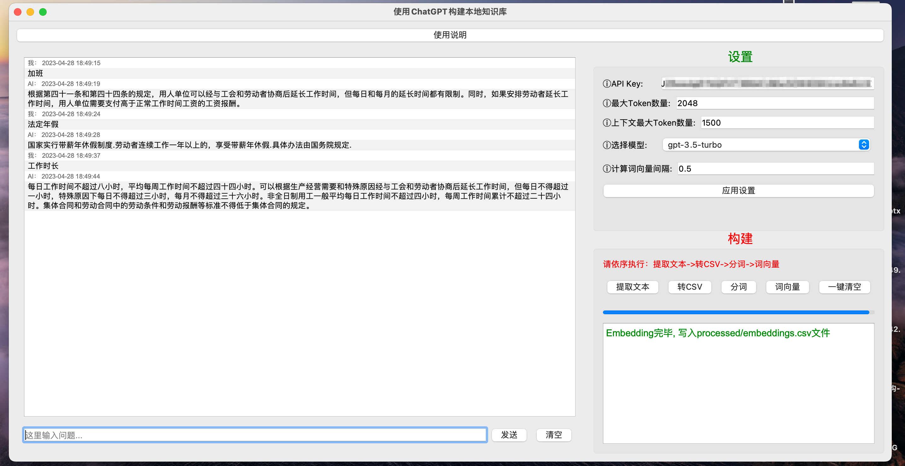
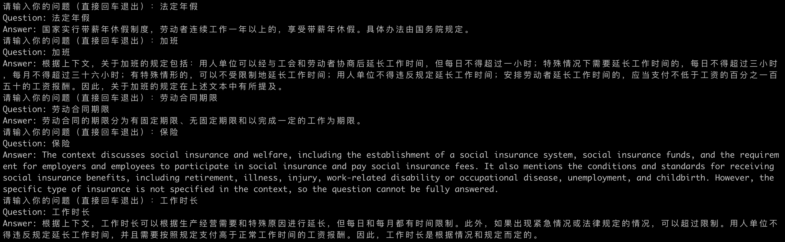

## 使用 ChatGPT 构建本地知识库


### 更新

#### 2022.4.28
- 使用pyqt5，搭建可视化界面，如下图



关注公众号，获取 ChatGPT 入门、进阶系列最新分享：


### 目的

1. 构建一个本地知识库查询系统，区别于使用关键字检索，使用词向量相似度计算可以理解语义。
2. GPT 类模型虽然拥有大量知识，但有时候我们只想让它基于给定的某些知识（这些知识可能是 GPT 不具有或者不精通的）进行回答，而且如果不限定知识范围， GPT 有时候会编造。例如：我只想让 GPT 基于我所有的学习笔记进行回答。
3. 由于 openai 的 GPT 类接口都有最大 token 数量限制，没办法把沉淀的大段知识作为上下文提交给它。所以选择了找出与问题最相关的段落作为上下文与问题一起发送给接口。


以下是将劳动法作为知识库，进行的问答：



### 用法

1. 将文档拷贝到 doc 目录下。
2. 将 config-example.ini 重命名为 config.ini ，修改 config.ini 中的 OPENAI_API_KEY 为你的 key。
3. 安装 python 包：`pip install -r requirements.txt` (建议使用 conda 管理 python 环境)
4. 可视化运行 `python app.py`
5. 脚本运行
```
# 从文档中提取纯文本
python step1_to_text.py
# 将文本转为 csv 格式
python step2_to_csv.py
# 对文本进行 embedding，embedding 会消耗你的 token 数
python step3_token_embedding.py
# 开启问答，问答会消耗你的 token 数
python step4_question.py
```


目前支持的文档类型包括：

- html 文件：.html 后缀
- markdown 文件：.md 后缀
- word 文档：.docx 后缀
- excel 文档：.xlsx 后缀
- ppt 文档：.pptx 后缀

### 原理

1. 从 doc 目录下的各种文档中提取纯文本信息，并写入 text 目录。
2. 将纯文本写入 csv 文件，写入 processed 目录，为 embedding 做准备。
3. embedding 包括4个子步骤。
    1. 使用 “cl100k_base” 分词器对 csv 文件中的每一行文本进行分词。
    2. 对文本超长的行，分割为多行 （这一步是为了避免调用 ChatCompletion 接口时，发送的 context 超长）。
    3. 调用 openai 的 Embedding 接口进行 Embedding。
    4. 将结果写入 processed/embeddings.csv 。
4. 问答包括3个子步骤。
    1. 加载 processed/embeddings.csv 。
    2. 将问题进行 embedding ，并计算问题和 processed/embeddings.csv 中每一行文本的相似度，按相似度从高到低排序，取最高的N个文本。
    3. 将相似文本作为上下文和问题一起发送给模型。模型将会根据提供的上下文回答问题。
    4. Prompt：Answer the question based on the context below, and if the question can't be answered based on the context, say \"I don't know\"\n\nContext: {context}\n\n---\n\nQuestion: {question}\nAnswer:
5. 界面使用 pyqt5 搭建。

### TODO

1. 查找与问题最相似的段落时，不够准确，导致 GPT 回答不知道。应该还有比 openai 的 “cl100k_base和ada-002”组合更优的方法。
2. GPT 接口消耗 token，费钱！应该可以使用其他开源模型替代，比如尝试 ChatGLM。
3. 支持自定义 Prompt，支持设置其他参数，如：temperature、top_p 等。

### 关于应用的扩展思考

目前的【知识库】例子是通过 Prompt 让 ChatGPT 据实回答。
其实也可以修改 Prompt 和其他参数，让 ChatGPT 的回答更有创造性。
例如将一整本小说作为知识库，让 ChatGPT 根据与要求相似的内容进行再创作。


### 例子

除了开头查询劳动法，我还使用自己关于Innodb的笔记进行了知识库构建，以下是构建完成后进行的问答：

>Question: innode的原理
>
>Answer: InnoDB使用redo log进行数据恢复的原理，但是没有提到InnoDB的整体原理。

>Question: InnoDB使用redo log进行数据恢复的原理是什么
>
>Answer: InnoDB使用redo log进行数据恢复的原理是将写操作产生的变化以日志的形式记录到redo log文件中，当服务重启时读取redo log，对那些服务崩溃时还没有写入文件的数据进行恢复。

>Question: redo log是什么
>
>Answer: redo日志是将每条记录的修改内容顺序写入的日志，用于在系统崩溃后重做用户的写操作。

>Question: 怎么使用redo log进行恢复
>
>Answer: 使用redo log进行恢复的方法是在系统崩溃后，从redo日志中读取记录的修改内容，按照顺序重新执行这些修改操作，以重建buffer pool中的数据。

>Question: minitransaction是什么
>
>Answer: I don't know.

>Question: mtr是什么
>
>Answer: MTR stands for "mini-transaction record".

>Question: innode一行记录是什么样子
>
>Answer: innodb行记录包括变长字段长度列表、NULL值列表、纪录头信息和各列的值。变长字段长度列表存储各个变长字段在这条纪录中占用的字节数，逆序存放；NULL值列表记录哪些列的值为NULL；纪录头信息包括删除位标志和记录类型；各列的值包括隐藏列rowid和各个列的实际值。

>Question: 介绍一下innodb的锁
>
>Answer: 当不同的事务以不同的顺序获取某些记录的锁时，可能会发生死锁。当死锁发生时，innodb会回滚一个事务以释放该事务拥有的锁（根据哪个事务写操作影响的记录数更少选择）。可以通过设置全局系统变量innodb_print_all_deadlocks为ON，将所有死锁信息记录到mysql的错误日志中。最近一次死锁的详细过程可以通过show engine innodb status命令查看。

>Question: innodb锁有哪几种
>
>Answer: I don't know.

>Question: 介绍一下innodb的锁
>
>Answer: 当不同的事务以不同的顺序获取某些记录的锁时，可能会发生死锁。当死锁发生时，innodb会回滚一个事务以释放该事务拥有的锁。可以通过设置全局系统变量innodb_print_all_deadlocks为ON，将所有死锁信息记录到mysql的错误日志中。最近一次死锁的详细过程可以通过show engine innodb status命令查看。

>Question: 行级锁又分为哪些锁
>
>Answer: I don't know.

>Question: 间隙锁是什么
>
>Answer: 间隙锁是一种锁类型，包括S锁和X锁，用于阻止间隙中插入或删除数据，不影响当前记录，可以继续加锁。它的目的是为了保护间隙，防止其他事务在间隙中插入或删除数据。

>Question: 解释explain返回的type
>
>Answer: The "type" column in the EXPLAIN output explains the type of access method that will be used to retrieve the data, such as "system", "const", "eq_ref", "ref", or "fulltext".

>Question: explain返回的type 中system, const, eq_ref, ref, fulltext都代表什么
>
>Answer: system代表当表中只有一条记录且存储引擎的统计数据是精确的（例如MyISAM、MEMORY），对该表的访问是system。const代表使用主键或者唯一索引与常数进行等值匹配。eq_ref代表连接时对被驱动表使用主键或者不允许null值的唯一索引进行等值匹配。ref代表使用二级索引与常量进行等值匹配。fulltext代表全文索引。

>Question: 介绍事务
>
>Answer: 事务是一组数据库操作，具有ACID特性，包括原子性、隔离性、一致性和持久性。事务有不同的执行状态，包括活动的、部分提交的、失败的、中止的和提交的。事务的语法包括begin、start transaction、commit、savepoint、release savepoint、rollback和autocommit。同时，DDL和事务语句等语句会隐式提交上一个事务。

>Question: 什么是lsn
>
>Answer: lsn是代表写入了log buffer的总redo日志量的变量。

>Question: innodb为什么不存储记录数量
>
>Answer: I don't know.

>Question: innodb和myisam区别
>
>Answer: I don't know.